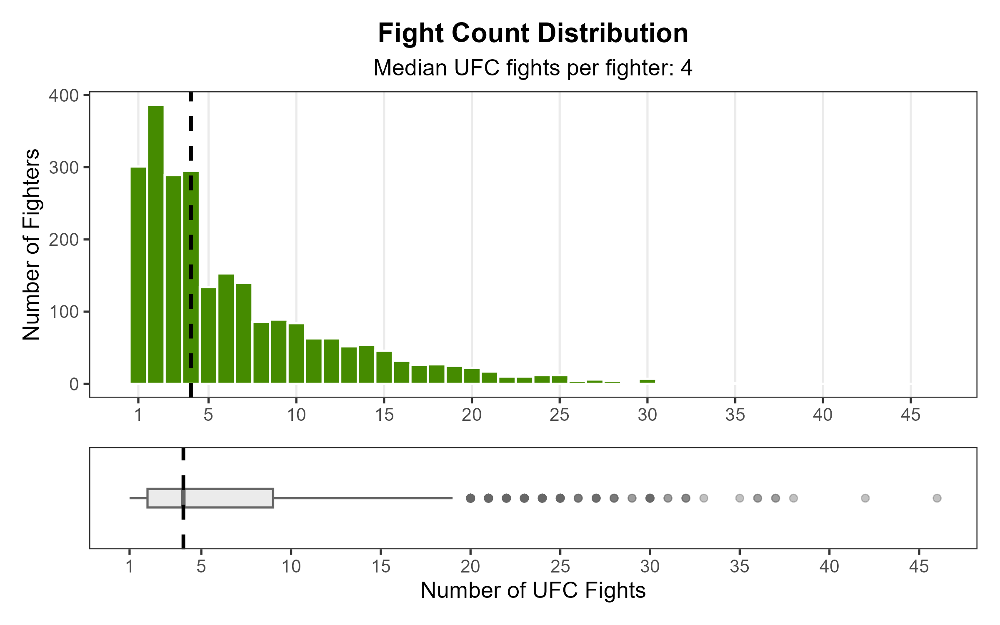
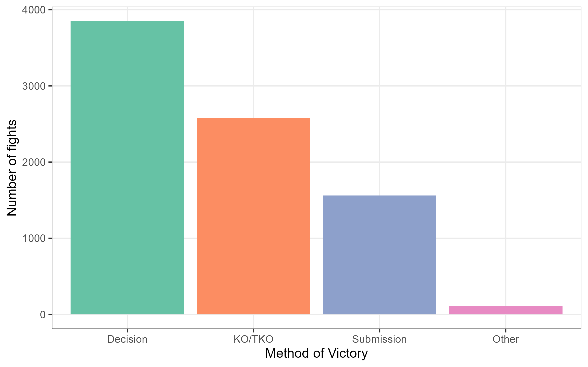
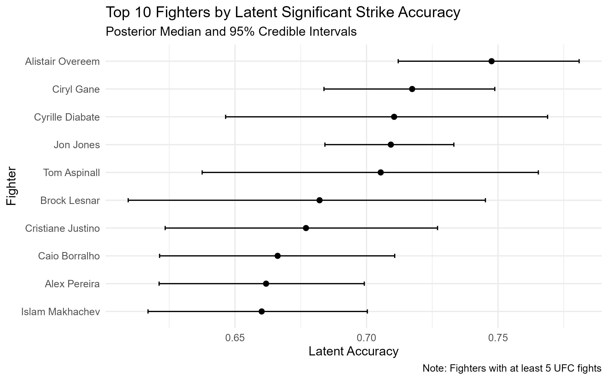
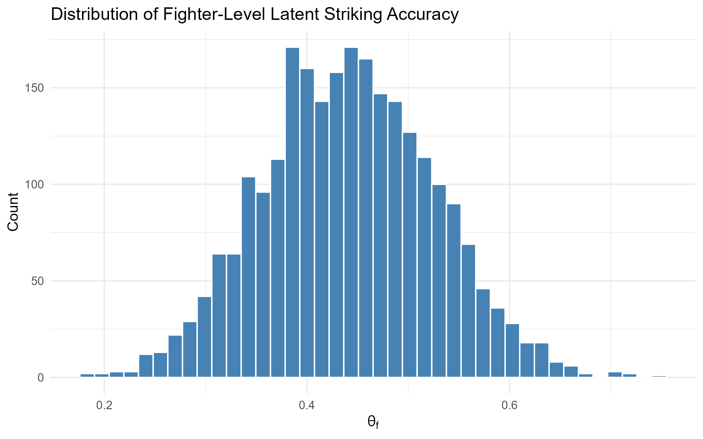

# Project Scrapyard

In this project, I investigate two central questions about fighter performance in the [UFC](http://www.ufcstats.com/statistics/events/completed):

1. Which in-fight performance differential metric is the most predictive of winning?

2. What is each fighter's *latent* probability of landing a significant strike, after accounting for gender, weight class, and fight-to-fight randomness?

## Figure Gallery

<p align="center">
  <div style="display: flex; flex-wrap: wrap; justify-content: center; gap: 20px; max-width: 1200px;">
    
    
    
    
  </div>
</p>


## Project Structure

```
root/
├── cache/                      # Raw HTML files from scraping (ignored by Git)
│
├── data/                       # All datasets
│   ├── raw/                    # Untouched CSVs directly from scraping
│   ├── clean/                  # Outputs from scripts/data_cleaning.R
│   └── model/                  # Modeling-ready data
│
├── scripts/                    # Data scraping and cleaning pipeline
│   ├── 00_build_fight_data_raw_enriched.R
│   ├── 01_clean_fight_data.R
│   ├── 02_build_fighters_data_raw.R
│   └── 09_make_striking_data.R # Need to fix
│
├── eda/                   
│   └── eda.Rmd                 # Exploratory data analysis
│
├── figs/                       # Generated figures
│
├── models/fits                 # Saved model fits (.rds) from brms/Stan
│   ├── fit_prior_acc.rds
│   └── fit_acc_model.rds
│
├── reports/                    # Rendered outputs
│   ├── midterm/                # Draft report for midterm checkpoint
│   └── final/                  # Final report PDF
│
├── .gitignore                  # Git ignore rules
├── README.md                   # Project overview (this file)
└── LICENSE / requirements.txt  # Optional metadata
```

